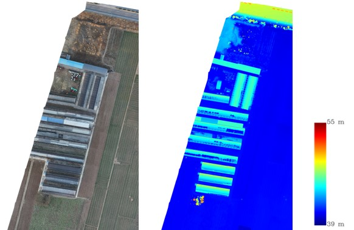

# 遥感数据介绍

广义上，遥感是指遥远的感知，是指在不直接接触的情况下，对目标或自然现象远距离探测和感知的一种技术。一般我们所说的遥感为电磁波遥感，即在某平台上利用传感器探测电磁波反射或发射，并从中提取信息的过程。这个过程获取的图像数据一般即为卫星和航空影像。遥感数据可以被用于各种应用程序中，为空间分析等提供数据源，也可以在包括场景分类、图像分割与检测等CV领域进行判别或提取。

目前常用的遥感影像来自各种商业卫星影像提供商如Google等，以及来自NASA、ESA等的开放数据。可以从它们的官网中找到更多信息。

## 图像的工作原理

卫星和航空图像来自各种来源的栅格数据，经过接收方的部分处理后进行发布，如几何校正、辐射校正、大气校正或者色彩校正等，使其可以进行较准确的定量分析或具有更加逼真的视觉效果。

### 栅格数据

所有卫星和航空图像都以光栅格式存储。栅格是一种基于像素的数据格式，可以有效地表示连续表面。栅格中的信息存储在网格结构中，每个信息单元或像素具有相同的大小和形状，但值不同。数码照片、正射影像和卫星图像都以这种格式存储。

栅格格式非常适合用于查看空间和时间变化的分析，因为每个数据值都有一个基于网格的可访问位置。这使我们能够访问两个或多个不同栅格中的相同地理位置并比较它们的值。

### 卫星栅格

当地球观测卫星拍摄照片时，传感器会读取并记录从沿电磁光谱的波长收集的反射率值，并利用反射率计算各个栅格像元的DN值（Digital Number），即遥感影像像元的亮度值，记录的地物的灰度值。

而利用遥感图像的目的之一就是使用DN值可以反算地物的辐照率和反射率。它们之间的关系如下公式所示，其中$gain$和$bias$分别指传感器的增益和偏移；$L$是辐射率，也称为辐射亮度值；$\rho$是地物反射率；$d_{s}$、$E_{0}$和$\theta$分别表示日地天文单位距离、太阳辐照度以及太阳天顶角。
$$
L = gain * DN + bias \\
\rho = \pi Ld^{2}_{s}/(E_{0}\cos{\theta})
$$
电磁波谱是人类根据电磁波的波长或频率、波数、能量等的大小顺序进行排列的成果。在电磁波谱中人眼只能感受到一个很小的波段范围，这个范围被称为可见光，波长范围在0.38-0.76μm。这是因为我们的视觉进化为在太阳发出最多光的地方最敏感，并且广泛地局限于构成我们所谓的红色、绿色和蓝色的波长。但卫星传感器可以感知范围更广的电磁频谱，这使得我们能够与借助传感器感知更多的频谱范围。

电磁波谱范围很广，传感器同时收集所有波长的信息是不切实际的。相反，不同的传感器优先考虑从不同波长的光谱收集信息。由传感器捕获和分类的频谱的每个部分都被归类为一个信息带。信息带的大小各不相同，可以编译成不同类型的合成图像，每个图像都强调不同的物理特性。同时，大多数遥感图像都为16位的图像，与传统的8位图像不同，它能表示更精细的光谱信息。

#### RGB

RGB图像与我们常见的自然图像类似，也符合人类的视觉常识（如树是绿色的、水泥是灰色的等），三个通道分别表示红、绿和蓝。一般的RGB数据来自于无人机影像、各种电子地图下载器等，如下图所示。

由于当前大多数CV任务的流程都是基于自然图像进行设计的，因此RGB类型的遥感数据集依然是使用较多的。

#### MSI/HSI

MSI*（Multispectral Image，多光谱图像）*和HSI*（Hyperspectral Image，高光谱图像）*均是一种波段数均大于3的遥感影像，其波段由几个到几百个不等，以不同的光谱分辨率*（光谱分辨率是指传感器所能记录的电磁波谱中，某一特定的波长范围值，波长范围值越宽，光谱分辨率越低）*进行区分。通常光谱分辨率在波长的1/10数量级范围内称为多光谱。其中多光谱影像的波段较少，谱带较宽，空间分辨率较高；而高光谱影像的波段较多，谱带较窄，光谱分辨率较高。

在使用中，MSI/HSI有一些常用波段具有不同的作用，例如中红外波段的透射率在60%-70%，包含地物反射及发射光谱，可以用来探测火灾等高温目标；红边波段*（绿色植物在0.67-0.76μm之间反射率增高最快的点，也是一阶导数光谱在该区间内的拐点）*是指示绿色植物生长状况的敏感性波段，可以有效地监测植被的生长状况，用于研究植物养分、健康状态监测、植被识别和生理生化参数等信息等。

下面以天宫一号高光谱成像仪拍摄的北京大兴机场为例，简单介绍一下波段组合和光谱曲线。天宫一号高光谱数据集根据波段信噪比和信息熵评价结果，剔除信噪比和信息熵较低的波段，结合图像实际目视结果，剔除了部分波段，共有可见近红外谱段54 个；短波红外谱段 52 个以及1个全色谱段数据。

##### 波段组合

波段组合是指在MSI/HSI中选择三个波段数据进行组合，代替RGB三个通道所得到的结果，称为彩色图*（RGB三波段的合成图称为真彩色图，任意非RGB波段的合成图称为假彩色图）*。不同彩色图的组合能够突出不同的地物特征，下图展示了不同的几种组合的效果。

##### 光谱曲线解读

不同的光谱能够突出不同的地物特征，以植物的光谱曲线为例，如下图所示，植被在0.8μm波段，反射率大于40%，相比在0.6μm波段10%左右的反射率明显更大，因此在成像时反射回更多的辐射能量。所以成像时0.8μm波段的植被亮度大于0.6μm波段的植被亮度，也就是图上看起来就更明亮了。

了解MSI/HSI的波段后，可以根据资源使用不同数量和不同组合方式的使用MSI/HSI完成各类任务，也可以使用如PCA、小波变换等方法对MSI/HSI进行降维处理，以减少冗余，使用更少的计算资源完成任务。

#### SAR

SAR（Synthetic Aperture Radar）是主动式侧视雷达系统，且成像几何属于斜距投影类型。因此SAR图像与光学图像在成像机理、几何特征、辐射特征等方面都有较大的区别。

与光学图像不同，光学图像不同波段的信息来自不不同波长的电磁波反射，以便于识别目标和分类提取；SAR图像则记录了不同波段和不同极化*（即电磁波发射和接收的振动方向）*的回波信息，以二进制复数形式记录下来，并且基于每个像素的复数数据可变换提取相应的振幅和相位信息。相位信息人类无法直接分辨，但振幅信息可以，利用振幅信息可以得到强度图像如下图所示。

由于SAR图像的成像机理的不同，SAR影像分辨率相对较低、信噪比较低，所以SAR影像中所包含的振幅信息远达不到同光学影像的成像水平，因此在CV领域使用较少。而其的主要作用在于基于相位信息可以进行沉降检测反演、三维重建等，同时SAR卫星波长较长，具有一定的云层和地表穿透能力，有其独特的使用优势。

#### RGBD

RGBD与RGB图像的区别在于多了一个D通道，即深度。深度图像类似于灰度图像，只是它的每个像素值是传感器距离物体的实际距离。通常RGB图像和深度图像是配准的，因而两幅图像对应于同一空间位置的点是一一对应的。如下图所示为部分无人机航摄的RGBD图像，其中可以看出建筑物与地面之间的相对高度。

深度图像提供了RGB图像所不具有的高度信息，能够在下游任务中对一些光谱特征相似的地物起到一定的区分作用。
