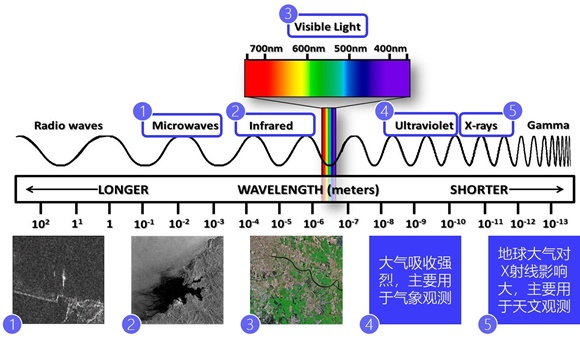
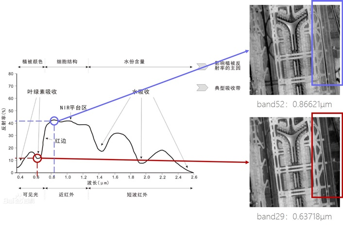

# 遥感数据介绍

广义上，遥感是指遥远的感知，是指在不直接接触的情况下，对目标或自然现象远距离探测和感知的一种技术。一般我们所说的遥感为电磁波遥感，即在某平台上利用传感器探测电磁波反射或发射，并从中提取信息的过程。这个过程获取的图像数据一般即为卫星和航空影像。遥感数据可以被用于各种应用程序中，为空间分析等提供数据源，也可以在包括场景分类、图像分割与检测等CV领域进行判别或提取。

目前常用的遥感影像来自各种商业卫星影像提供商如Google等，以及来自NASA、ESA等的开放数据。可以从它们的官网中找到更多信息。

## 图像的工作原理

卫星和航空图像来自各种来源的栅格数据，经过接收方的部分处理后进行发布，如几何校正、辐射校正、大气校正或者色彩校正等，使其可以进行较准确的定量分析或具有更加逼真的视觉效果。

### 栅格数据

所有卫星和航空图像都以光栅格式存储。栅格是一种基于像素的数据格式，可以有效地表示连续表面。栅格中的信息存储在网格结构中，每个信息单元或像素具有相同的大小和形状，但值不同。数码照片、正射影像和卫星图像都以这种格式存储。

栅格格式非常适合用于查看空间和时间变化的分析，因为每个数据值都有一个基于网格的可访问位置。这使我们能够访问两个或多个不同栅格中的相同地理位置并比较它们的值。

### 卫星栅格

当地球观测卫星拍摄照片时，它们会读取并记录从沿电磁光谱的波长收集的反射率值。

人眼只能看到一小部分光能，即电磁波谱。这被称为可见光，因为我们的视觉进化为在太阳发出最多光的地方最敏感，并且广泛地局限于构成我们所谓的红色、绿色和蓝色的波长。卫星传感器感知范围更广的电磁频谱。传感器收集我们正常视力范围之外的信息的能力使我们能够使以前不可见的可见。

电磁波谱范围很广，传感器同时收集所有波长的信息是不切实际的。相反，不同的传感器优先考虑从不同波长的光谱收集信息。由传感器捕获和分类的频谱的每个部分都被归类为一个信息带。信息带的大小各不相同，可以编译成不同类型的合成图像，每个图像都强调不同的物理特性。因此除符合人眼观察习惯的RGB图像外，还有HSI图像、SAR图像以及结合了深度信息的RGBD图像。

#### RGB

待更...

#### HSI

待更...

光谱曲线解读：植被在0.8μm波段，反射率大于40%，相比在0.6μm波段10%左右的反射率明显更大，因此在成像时反射回更多的辐射能量。所以成像时0.8μm波段的植被亮度大于0.6μm波段的植被亮度，也就是图上看起来就更明亮了。

天宫一号高光谱数据，北京大兴机场，不同波段组合。

#### SAR

待更...

#### RGBD

待更...

